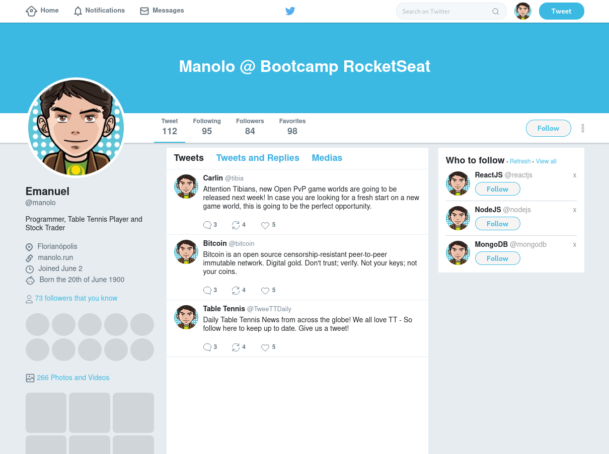

<h1 align="center">
  
</h1>

<h3 align="center">
  :rocket: [Bootcamp GoStack#10] Aula bônus FlexBox
</h3>

### Flexbox
Estudos sobre Flexbox aprendidos nas aulas Bônus do Bootcamp GoStack da RocketSeat.  
Reprodução do layout do twitter.com feito com Flexbox.  

<h1 align="center">
  
</h1>

#### Tips
Use um Live Reloader.